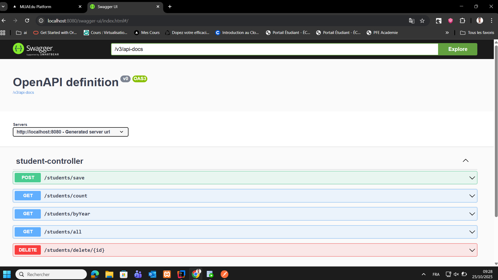

# Application de Gestion des Étudiants - Spring Boot

Une application REST complète développée avec **Spring Boot 3.5.7** pour gérer les informations des étudiants avec une base de données MySQL.

## Table des matières
- [Fonctionnalités](#fonctionnalités)
- [Technologies utilisées](#technologies-utilisées)
- [Prérequis](#prérequis)
- [Installation et configuration](#installation-et-configuration)
- [Structure du projet](#structure-du-projet)
- [API REST - Endpoints](#api-rest---endpoints)
- [Documentation Swagger](#documentation-swagger)
- [Tests unitaires](#tests-unitaires)
- [Captures d'écran](#captures-décran)
- [Auteur](#auteur)

---

## Fonctionnalités
- CRUD complet des étudiants (Create, Read, Update, Delete)
- Recherche et listage de tous les étudiants
- Comptage du nombre total d'étudiants
- Statistiques des étudiants par année de naissance
- Documentation API interactive avec Swagger/OpenAPI
- Tests unitaires avec JUnit 5 et Mockito
- Validation des données d'entrée
- Gestion des erreurs HTTP appropriées

---

## Technologies utilisées
| Technologie | Version | Description |
|-------------|---------|-------------|
| Java | 17 | Langage de programmation |
| Spring Boot | 3.5.7 | Framework backend |
| Spring Data JPA | 3.5.5 | Persistance des données |
| Hibernate | 6.6.33 | ORM (Object-Relational Mapping) |
| MySQL | 8.0.40 | Base de données relationnelle |
| Maven | 3.x | Gestion des dépendances |
| JUnit 5 | 5.x | Framework de tests unitaires |
| Mockito | 5.x | Framework de mocking pour tests |
| Swagger/OpenAPI | 2.0.2 | Documentation API interactive |
| Spring Boot DevTools | - | Rechargement automatique en développement |

---

## Prérequis
Avant de démarrer l'application, assurez-vous d'avoir les éléments suivants installés sur votre machine :
- **Java Development Kit (JDK) 17** ou version supérieure. Téléchargez-le depuis [Oracle](https://www.oracle.com/java/technologies/javase/jdk17-archive-downloads.html) ou [OpenJDK](https://openjdk.org/).
- **Maven 3.x** pour la gestion des dépendances. Vérifiez l'installation avec `mvn -v`.
- **MySQL Server 8.0** ou supérieur. Créez une base de données nommée `student_db` (ou modifiez le nom dans le fichier de configuration).
- Un IDE comme IntelliJ IDEA, Eclipse ou VS Code pour le développement (optionnel, mais recommandé).
- Accès à un terminal pour exécuter les commandes Maven.

---

## Installation et configuration
Suivez ces étapes pour installer et configurer l'application :

1. **Cloner le projet** :
git clone <URL_DU_REPOSITORY>
cd student-management-app
text2. **Configurer la base de données** :
- Lancez MySQL et créez la base de données :
CREATE DATABASE student_db;
text- Modifiez le fichier `src/main/resources/application.properties` pour adapter les paramètres de connexion :
spring.datasource.url=jdbc:mysql://localhost:3306/student_db
spring.datasource.username=your_username
spring.datasource.password=your_password
spring.datasource.driver-class-name=com.mysql.cj.jdbc.Driver
spring.jpa.hibernate.ddl-auto=update
spring.jpa.show-sql=true
server.port=8081
text3. **Compiler et installer les dépendances** :
mvn clean install
text4. **Lancer l'application** :
mvn spring-boot:run
textL'application sera accessible sur `http://localhost:8081`.

5. **Vérification** :
- Accédez à Swagger UI pour tester les endpoints : `http://localhost:8081/swagger-ui/index.html`.
- Vérifiez les logs pour confirmer la connexion à la base de données.

**Note** : En mode développement, Spring Boot DevTools permet un rechargement automatique des modifications.

---

## Structure du projet
Le projet suit une structure Maven standard avec une organisation en paquets pour respecter l'architecture en couches :
student-management-app/
├── pom.xml                          # Configuration Maven et dépendances
├── src/
│   ├── main/
│   │   ├── java/
│   │   │   └── com/example/student/
│   │   │       ├── StudentApplication.java     # Classe principale Spring Boot
│   │   │       ├── config/                     # Configurations (Swagger, JPA, etc.)
│   │   │       ├── controller/                 # Contrôleurs REST (StudentController.java)
│   │   │       ├── service/                    # Services métier (StudentService.java)
│   │   │       ├── repository/                 # Repositories JPA (StudentRepository.java)
│   │   │       ├── entity/                     # Entités de domaine (Student.java)
│   │   │       └── dto/                        # Objets de transfert de données (StudentDTO.java)
│   │   └── resources/
│   │       ├── application.properties          # Configuration de l'application
│   │       └── static/                         # Ressources statiques (optionnel)
│   └── test/
│       ├── java/
│       │   └── com/example/student/
│       │       ├── controller/                 # Tests des contrôleurs (StudentControllerTest.java)
│       │       └── service/                    # Tests des services (optionnel)
│       └── resources/                          # Données de test
└── Screen/                                     # Captures d'écran pour la documentation
├── Swagger.png
├── Post-save.png
├── Get-all.png
├── Get-count.png
├── Get-Year.png
├── Delete.png
└── test-apps.png
textCette structure favorise la modularité et la scalabilité.

---

## API REST - Endpoints
| Méthode HTTP | Endpoint | Description | Code de réponse |
|--------------|----------|-------------|-----------------|
| **POST** | `/students/save` | Créer ou modifier un étudiant | 201 Created |
| **GET** | `/students/all` | Récupérer tous les étudiants | 200 OK |
| **GET** | `/students/count` | Compter le nombre d'étudiants | 200 OK |
| **GET** | `/students/byYear` | Statistiques par année de naissance | 200 OK |
| **DELETE** | `/students/delete/{id}` | Supprimer un étudiant | 204 No Content / 404 Not Found |

### Exemple de requête POST
**Endpoint** : `http://localhost:8081/students/save`

**Corps de la requête (JSON)** :
```json
{
  "nom": "Dupont",
  "prenom": "Jean",
  "dateNaissance": "2000-05-15",
  "email": "jean.dupont@example.com"
}
Réponse attendue (201 Created) :
json{
  "id": 1,
  "nom": "Dupont",
  "prenom": "Jean",
  "dateNaissance": "2000-05-15",
  "email": "jean.dupont@example.com"
}

Documentation Swagger
L'application intègre Swagger/OpenAPI pour une documentation interactive de l'API.
Accès à l'interface Swagger UI :
texthttp://localhost:8081/swagger-ui/index.html
Accès à la documentation JSON :
texthttp://localhost:8081/v3/api-docs
Swagger permet de :

Visualiser tous les endpoints disponibles
Tester les API directement depuis le navigateur
Consulter les schémas de données (modèles)
Voir les codes de réponse HTTP possibles


Tests unitaires
Le projet inclut 7 tests unitaires dans StudentControllerTest.java utilisant JUnit 5 et Mockito :


TestDescriptiontestSaveStudentVérifie la création d'un étudiant (201 Created)testDeleteStudentVérifie la suppression réussie (204 No Content)testDeleteStudentNotFoundVérifie la suppression échouée (404 Not Found)testFindAllStudentsVérifie la récupération de tous les étudiantstestCountStudentsVérifie le comptage des étudiantstestFindByYearVérifie les statistiques par année (liste vide)testFindByYearWithDataVérifie les statistiques avec données
Exécuter les tests :
textmvn test
Résultat des tests :
textTests run: 8, Failures: 0, Errors: 0, Skipped: 0
BUILD SUCCESS

Captures d'écran
1. Interface Swagger - Documentation API

Interface interactive Swagger permettant de tester tous les endpoints REST de l'application
2. POST /students/save - Créer un étudiant

Création d'un nouvel étudiant via l'endpoint POST avec réponse 201 Created
3. GET /students/all - Liste de tous les étudiants

Récupération de la liste complète des étudiants enregistrés dans la base de données
4. GET /students/count - Compter les étudiants

Obtenir le nombre total d'étudiants présents dans la base
5. GET /students/byYear - Statistiques par année

Statistiques du nombre d'étudiants regroupés par année de naissance
6. DELETE /students/delete/{id} - Supprimer un étudiant

Suppression d'un étudiant par son identifiant avec réponse 204 No Content
7. Tests unitaires - Résultats

Résultats de l'exécution des 7 tests unitaires - Tous réussis avec succès

Architecture de l'application
L'application suit une architecture en couches (Layered Architecture) :
text┌─────────────────────────────────────────┐
│ Controller Layer │ ← API REST (StudentController)
│ (Gestion des requêtes HTTP) │
└─────────────────────────────────────────┘
                    ↓
┌─────────────────────────────────────────┐
│ Service Layer │ ← Logique métier (StudentService)
│ (Traitement et validation) │
└─────────────────────────────────────────┘
                    ↓
┌─────────────────────────────────────────┐
│ Repository Layer │ ← Accès données (StudentRepository)
│ (Communication avec la BD) │
└─────────────────────────────────────────┘
                    ↓
┌─────────────────────────────────────────┐
│ Database (MySQL) │ ← Base de données
│ (Stockage persistant) │
└─────────────────────────────────────────┘
Avantages de cette architecture :

Séparation des responsabilités : chaque couche a un rôle précis
Maintenabilité : modification facile sans impacter les autres couches
Testabilité : possibilité de tester chaque couche indépendamment
Réutilisabilité : logique métier réutilisable dans différents contextes
