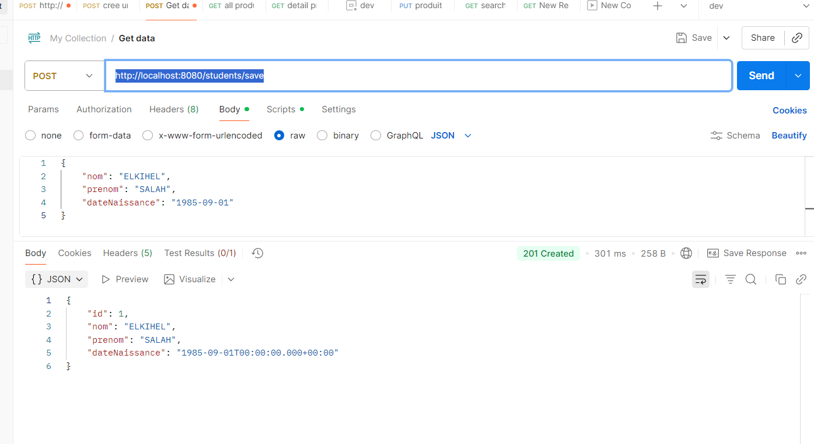
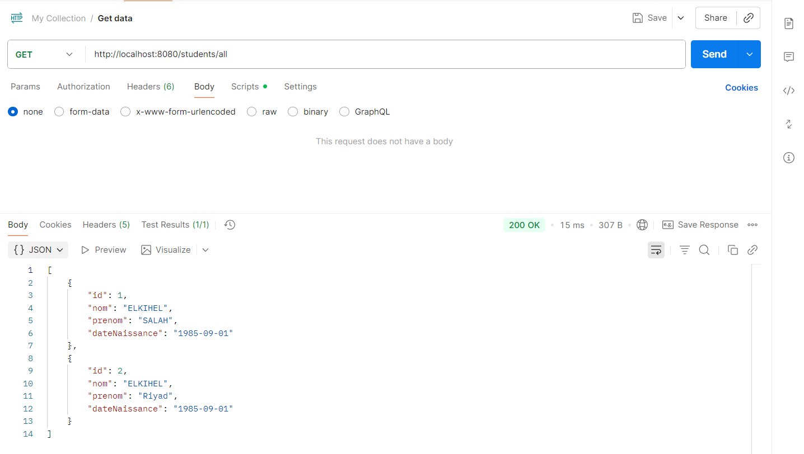
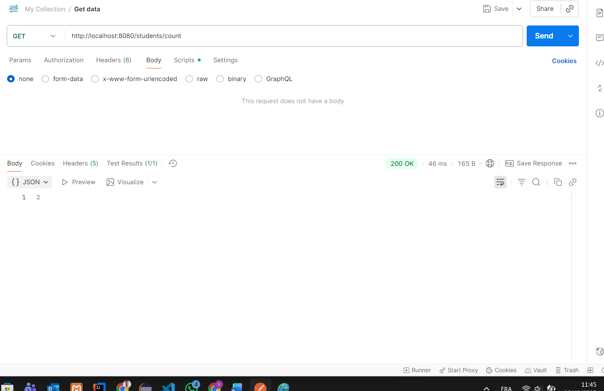
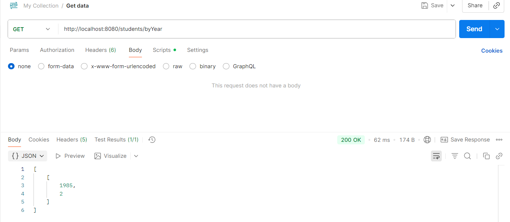
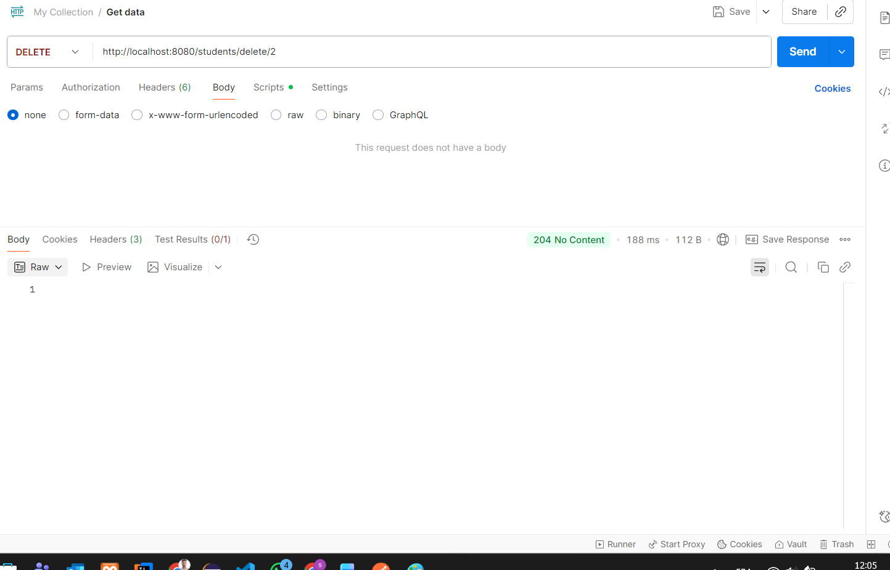
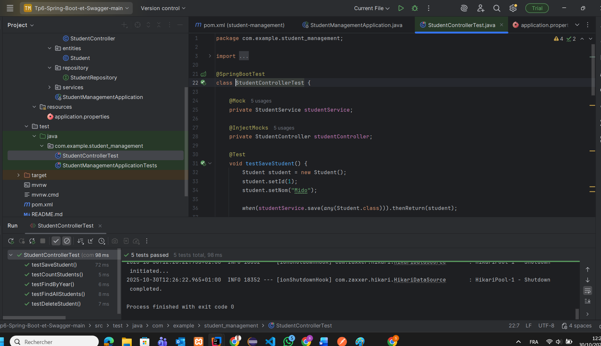

# Application de Gestion des Étudiants - Spring Boot

Une application REST complète développée avec **Spring Boot 3.5.7** pour gérer les informations des étudiants avec une base de données MySQL.

## Table des matières
- [Fonctionnalités](#fonctionnalités)
- [Technologies utilisées](#technologies-utilisées)
- [Prérequis](#prérequis)
- [Installation et configuration](#installation-et-configuration)
- [Structure du projet](#structure-du-projet)
- [API REST - Endpoints](#api-rest---endpoints)
- [Documentation Swagger](#documentation-swagger)
- [Tests unitaires](#tests-unitaires)
- [Captures d'écran](#captures-décran)
- [Auteur](#auteur)

---

## Fonctionnalités

- CRUD complet des étudiants (Create, Read, Update, Delete)
- Recherche et listage de tous les étudiants
- Comptage du nombre total d'étudiants
- Statistiques des étudiants par année de naissance
- Documentation API interactive avec Swagger/OpenAPI
- Tests unitaires avec JUnit 5 et Mockito
- Validation des données d'entrée
- Gestion des erreurs HTTP appropriées

---

## Technologies utilisées

| Technologie | Version | Description |
|-------------|---------|-------------|
| Java | 17 | Langage de programmation |
| Spring Boot | 3.5.7 | Framework backend |
| Spring Data JPA | 3.5.5 | Persistance des données |
| Hibernate | 6.6.33 | ORM (Object-Relational Mapping) |
| MySQL | 8.0.40 | Base de données relationnelle |
| Maven | 3.x | Gestion des dépendances |
| JUnit 5 | 5.x | Framework de tests unitaires |
| Mockito | 5.x | Framework de mocking pour tests |
| Swagger/OpenAPI | 2.0.2 | Documentation API interactive |
| Spring Boot DevTools | - | Rechargement automatique en développement |

---


## API REST - Endpoints

| Méthode HTTP | Endpoint | Description | Code de réponse |
|--------------|----------|-------------|-----------------|
| **POST** | `/students/save` | Créer ou modifier un étudiant | 201 Created |
| **GET** | `/students/all` | Récupérer tous les étudiants | 200 OK |
| **GET** | `/students/count` | Compter le nombre d'étudiants | 200 OK |
| **GET** | `/students/byYear` | Statistiques par année de naissance | 200 OK |
| **DELETE** | `/students/delete/{id}` | Supprimer un étudiant | 204 No Content / 404 Not Found |

### Exemple de requête POST

**Endpoint** : `http://localhost:8081/students/save`


## Documentation Swagger

L'application intègre **Swagger/OpenAPI** pour une documentation interactive de l'API.

**Accès à l'interface Swagger UI** :
```
http://localhost:8081/swagger-ui/index.html
```

**Accès à la documentation JSON** :
```
http://localhost:8081/v3/api-docs
```

Swagger permet de :
- Visualiser tous les endpoints disponibles
- Tester les API directement depuis le navigateur
- Consulter les schémas de données (modèles)
- Voir les codes de réponse HTTP possibles

---

## Tests unitaires

Le projet inclut **7 tests unitaires** dans `StudentControllerTest.java` utilisant JUnit 5 et Mockito :

| Test | Description |
|------|-------------|
| `testSaveStudent` | Vérifie la création d'un étudiant (201 Created) |
| `testDeleteStudent` | Vérifie la suppression réussie (204 No Content) |
| `testDeleteStudentNotFound` | Vérifie la suppression échouée (404 Not Found) |
| `testFindAllStudents` | Vérifie la récupération de tous les étudiants |
| `testCountStudents` | Vérifie le comptage des étudiants |
| `testFindByYear` | Vérifie les statistiques par année (liste vide) |
| `testFindByYearWithData` | Vérifie les statistiques avec données |

**Résultat des tests** :
```
Tests run: 8, Failures: 0, Errors: 0, Skipped: 0
BUILD SUCCESS
```

---

## Captures d'écran

### 1. Interface Swagger - Documentation API

*Interface interactive Swagger permettant de tester tous les endpoints REST de l'application*

---

### 2. POST /students/save - Créer un étudiant

*Création d'un nouvel étudiant via l'endpoint POST avec réponse 201 Created*

---

### 3. GET /students/all - Liste de tous les étudiants

*Récupération de la liste complète des étudiants enregistrés dans la base de données*

---

### 4. GET /students/count - Compter les étudiants

*Obtenir le nombre total d'étudiants présents dans la base*

---

### 5. GET /students/byYear - Statistiques par année

*Statistiques du nombre d'étudiants regroupés par année de naissance*

---

### 6. DELETE /students/delete/{id} - Supprimer un étudiant

*Suppression d'un étudiant par son identifiant avec réponse 204 No Content*

---

### 7. Tests unitaires - Résultats

*Résultats de l'exécution des 7 tests unitaires - Tous réussis avec succès*

---

## Architecture de l'application

L'application suit une **architecture en couches** (Layered Architecture) :

```
┌─────────────────────────────────────────┐
│         Controller Layer                │  ← API REST (StudentController)
│  (Gestion des requêtes HTTP)            │
└─────────────────────────────────────────┘
                    ↓
┌─────────────────────────────────────────┐
│         Service Layer                   │  ← Logique métier (StudentService)
│  (Traitement et validation)             │
└─────────────────────────────────────────┘
                    ↓
┌─────────────────────────────────────────┐
│         Repository Layer                │  ← Accès données (StudentRepository)
│  (Communication avec la BD)             │
└─────────────────────────────────────────┘
                    ↓
┌─────────────────────────────────────────┐
│         Database (MySQL)                │  ← Base de données
│  (Stockage persistant)                  │
└─────────────────────────────────────────┘
```

### Avantages de cette architecture :
- **Séparation des responsabilités** : chaque couche a un rôle précis
- **Maintenabilité** : modification facile sans impacter les autres couches
- **Testabilité** : possibilité de tester chaque couche indépendamment
- **Réutilisabilité** : logique métier réutilisable dans différents contextes

---

